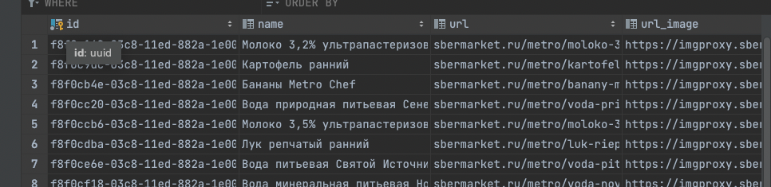

### Setup

Парсер на Golang.
К сожалению, распарсить ozon не получилось, там используется анти-спам блокировщик и при парсинге реальная страница
подменяется служебной. 

**Я решил взять страницу сбермаркета с товарами, суть по идее не меняется. Как было сказано - 
главное понять принцип.
Использовал следующую страницу с товарами https://sbermarket.ru/tvoydom/c/katalogh-tvoidom/produkty-pitaniia**

0. Подготовливаем папку для проекта
1. Запускаем базу через докер
2. Добавляем функции в постгре для использования uuid из Go 
(а именно - подключаемся к контейнеру, создаем нужную БД, создаем экстеншены)
3. Заносим нужные данные в конфинг (parser/configs/config.json)
4. Можем запустить main.go

Все необходимые для запуска команды

```bash
mkdir parser
cd parser
mod init parser
mod tidy 

docker run --name parser-pg -e POSTGRES_PASSWORD=pass -p 5432:5432 -d postgres
docker ps // чтобы увидить айди контейнера

docker exec -it container-id bash 
psql -U postgres
create database goods;
\c goods
CREATE EXTENSION IF NOT EXISTS "uuid-ossp";

// здесь мы должны занести креды от БД в файл ./configs/config.json
// переходим в корень проекта

go run main.go или go build & ./parser
```

### Результат в БД
